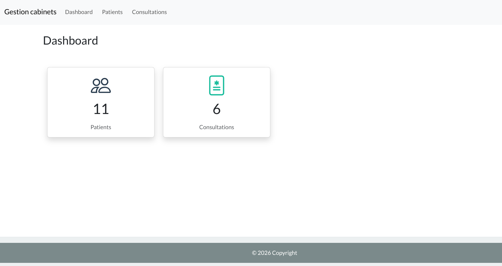
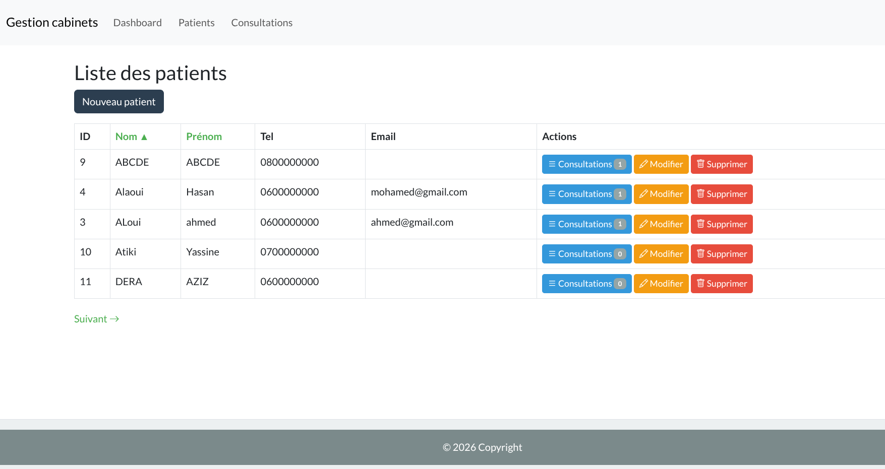
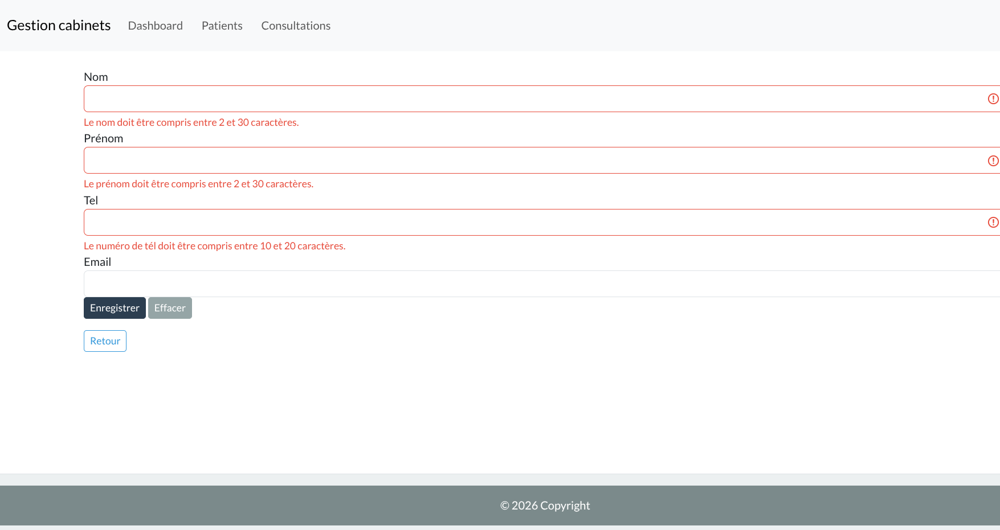
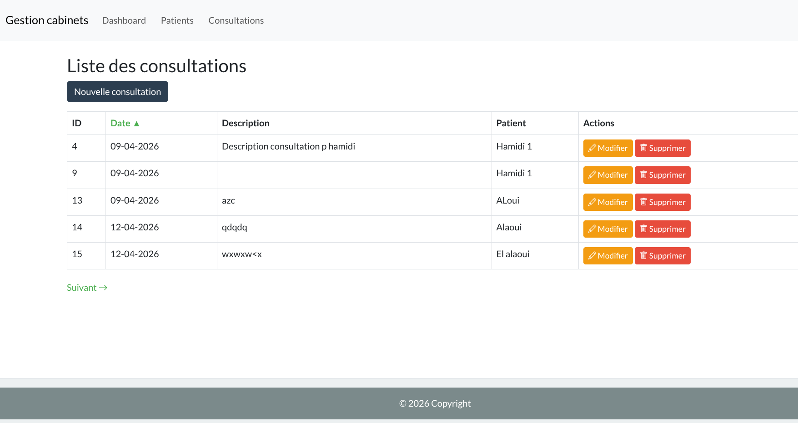
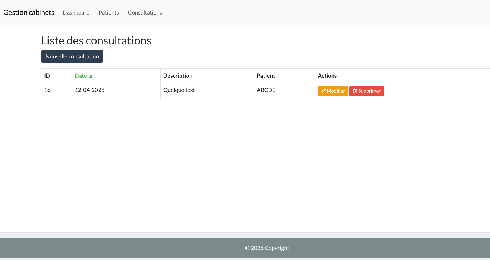
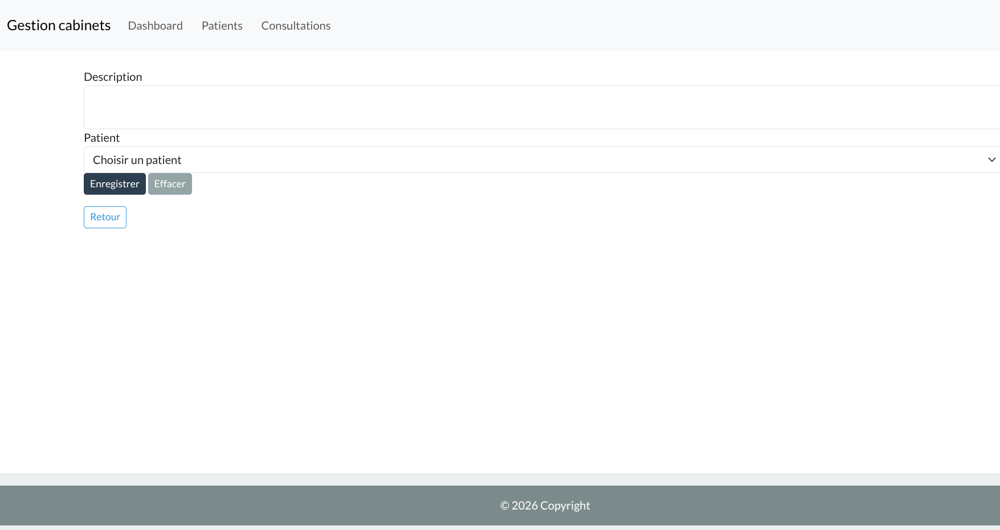

# GESTION DES CABINETS

## LES FONCTIONALITES
* Dashboard
* Liste de patients / consultation avec la pagination et le support de tri au niveau de tableau par nom et prénom pour les patients, et date pour les consultations.
* Les actions (ajout / modifier / supprimer / consultations) d'un(e) patient / consultation
* support de validation des données de formulaire.

## SCREENSHOOTS
- Dahsboard

- Liste des patients

- Liste des patients la page suivante

- Liste des patients tri par prenom

- Formulaire des patients avec la validation

- Liste des consultations avec pagination et tri pae date
  

- Liste des consultations patient
  

- Formulaire consultation avec validation

